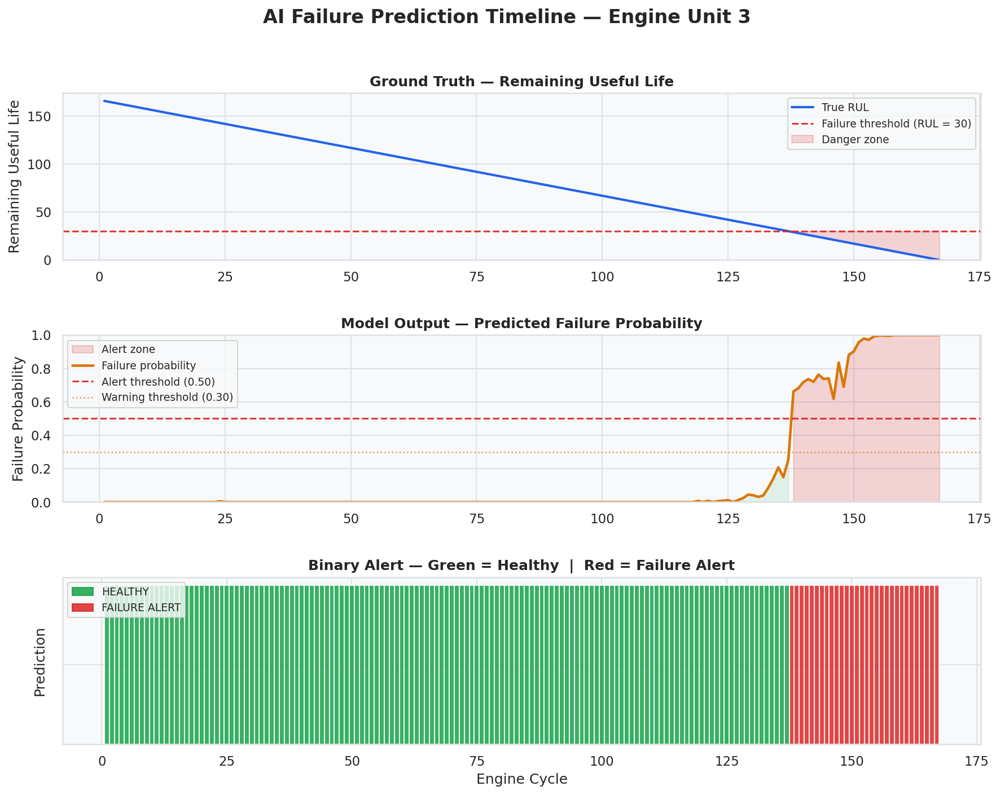
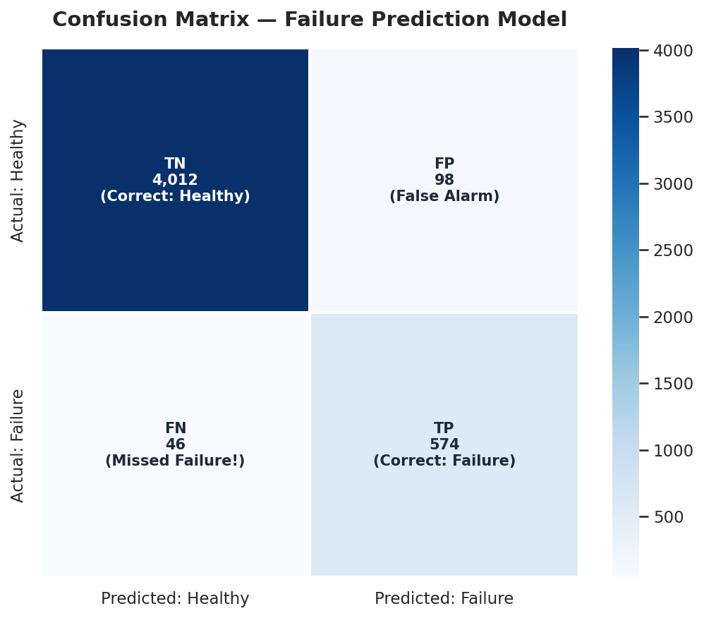
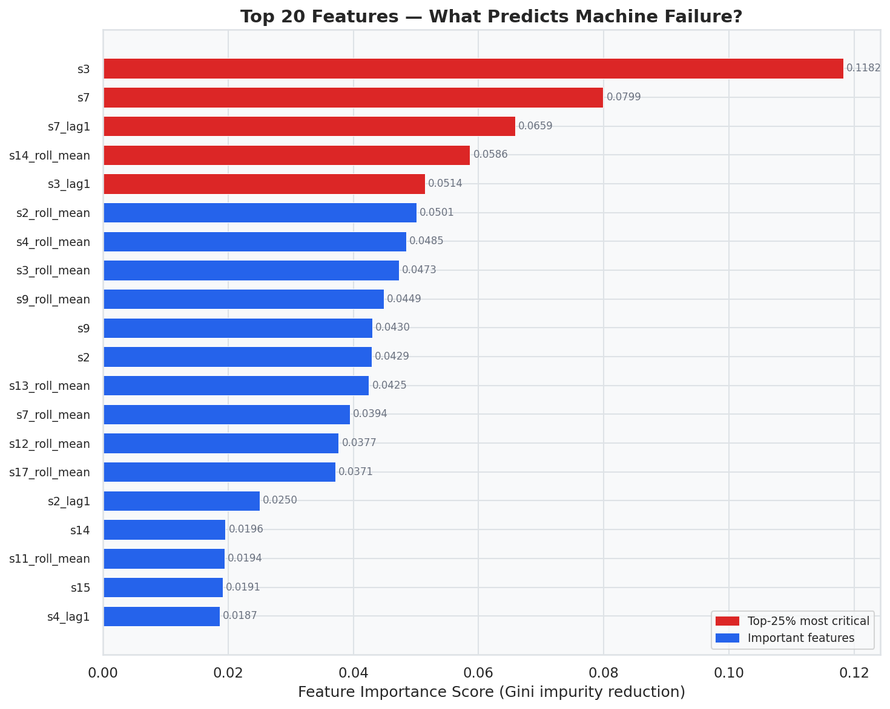
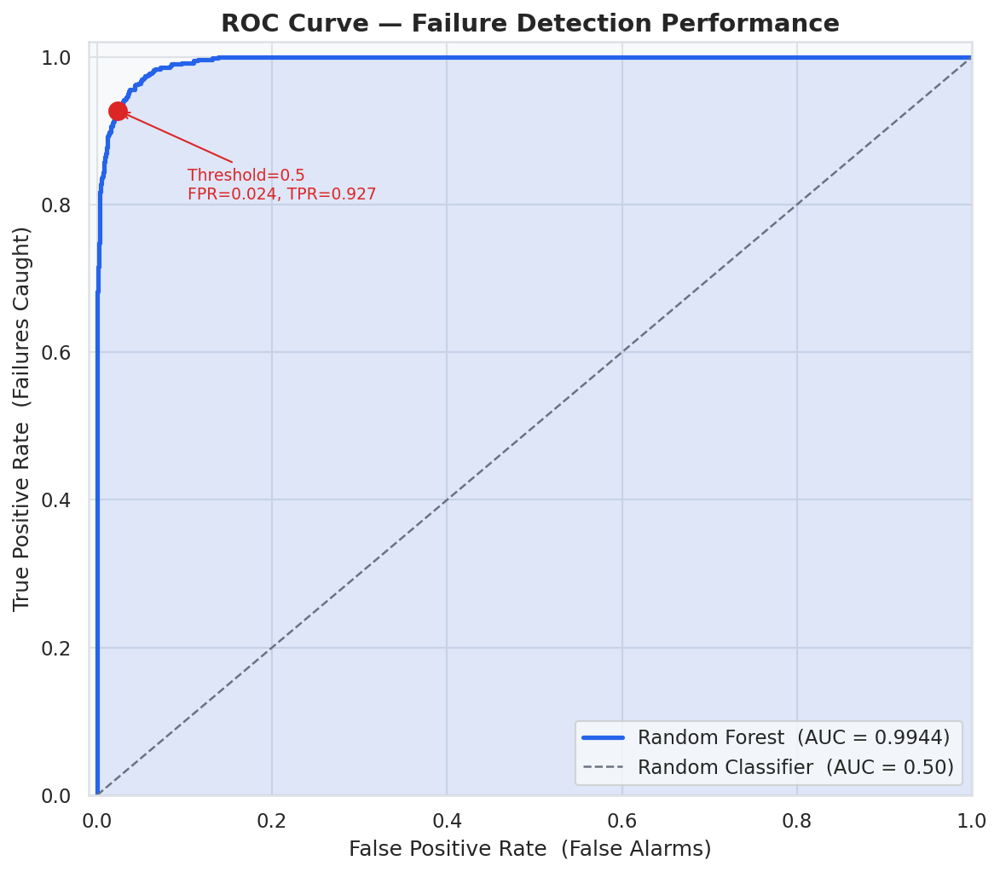
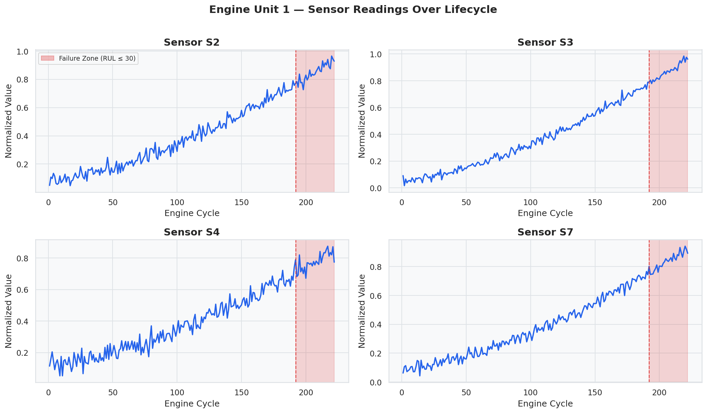

# AI-Powered Predictive Maintenance System for IoT Devices


---

## Overview

An end-to-end machine learning system that predicts **machine failure before it happens** using IoT sensor data from turbofan engines. Built on a synthetic NASA CMAPSS-style dataset, this project mirrors real-world industrial predictive maintenance pipelines used in manufacturing, aviation, and power generation.

> **No hardware needed.** The project uses a synthetic sensor dataset that realistically simulates 100 turbofan engines degrading over time until failure.

---

## Problem Statement

Unplanned machine downtime costs global industry over **$50 billion annually**.

| Maintenance Type | Approach | Problem |
|---|---|---|
| Reactive | Fix after failure | Expensive, dangerous |
| Scheduled | Fix on a calendar | Wasteful, misses failures |
| **Predictive (this project)** | **Fix when AI says so** | **Optimal — reduces cost by 30-40%** |

---

## Industry Applications

This exact architecture is used in:
- **Aerospace** — GE Aviation uses ML to monitor jet engine sensor degradation
- **Manufacturing** — Siemens deploys predictive maintenance on CNC machines
- **Energy** — Wind farm operators predict gearbox and bearing failures
- **Automotive** — BMW uses sensor fusion to predict component wear on assembly lines
- **Oil & Gas** — Pump and compressor failure prediction saves millions per incident

---

## Architecture

```
IoT Sensors (Temperature, Vibration, Pressure, RPM, Tool Wear)
        │
        ▼
┌──────────────────┐    ┌────────────────────┐    ┌─────────────┐
│  Data Layer      │ →  │  Processing Layer   │ →  │  ML Layer   │
│  Raw sensor CSV  │    │  Clean + Normalize  │    │  Random     │
│  26 columns      │    │  Feature Engineer   │    │  Forest     │
│  23,649 readings │    │  Rolling stats/lag  │    │  Classifier │
└──────────────────┘    └────────────────────┘    └─────────────┘
                                                          │
                        ┌─────────────────────────────────┘
                        ▼
              ┌──────────────────────────────────┐
              │  Output Layer                    │
              │  • Failure probability (0–100%)  │
              │  • NORMAL / WARNING / CRITICAL   │
              │  • Visualizations & reports      │
              └──────────────────────────────────┘
```

---

## Tech Stack

| Component | Technology |
|---|---|
| Language | Python 3.10+ |
| Data Processing | Pandas 2.1, NumPy 1.24 |
| Machine Learning | Scikit-learn 1.3 (Random Forest) |
| Visualization | Matplotlib 3.7, Seaborn 0.12 |
| Model Persistence | Joblib |
| Dataset | Synthetic NASA CMAPSS-style (100 engines, 23,649 readings) |

---

## Dataset

The dataset simulates a fleet of 100 turbofan engines monitored by 21 sensors:

| Column | Description |
|---|---|
| `unit` | Engine ID (1–100) |
| `cycle` | Operating cycle (1 to failure) |
| `op1, op2, op3` | Operational settings |
| `s1–s21` | Sensor readings (temp, pressure, vibration, RPM, etc.) |
| `RUL` | Remaining Useful Life (computed, not in raw data) |
| `failure_label` | **Target**: 1 = failure within 30 cycles, 0 = healthy |

**Class distribution:** ~87% healthy, ~13% failure (realistic industrial imbalance)

---

## Project Structure

```
AI-Predictive-Maintenance-IoT/
│
├── data/
│   ├── raw/                         # Raw sensor dataset
│   │   └── train_FD001.csv
│   └── processed/                   # Cleaned + feature-engineered data
│       ├── cleaned_data.csv
│       ├── features_df.csv
│       └── predictions_output.csv
│
├── src/
│   ├── preprocess.py                # Data cleaning, RUL, labels, normalization
│   ├── feature_engineering.py       # Rolling stats, lag features
│   ├── train_model.py               # Model training and evaluation
│   ├── predict.py                   # Inference + alert system
│   └── visualize.py                 # All chart generation
│
├── models/
│   ├── random_forest_model.pkl      # Trained model
│   └── feature_columns.pkl          # Feature column names
│
├── outputs/
│   ├── failure_prediction_timeline.png
│   ├── confusion_matrix.png
│   ├── feature_importance.png
│   ├── roc_curve.png
│   ├── sensor_degradation_unit1.png
│   ├── class_distribution.png
│   ├── sensor_heatmap.png
│   ├── performance_summary.png
│   ├── classification_report.txt
│   └── predictions_output.csv
│
├── generate_dataset.py              # Synthetic data generator
├── main.py                          # ← RUN THIS (full pipeline)
├── requirements.txt
├── .gitignore
└── README.md
```

---

## Installation

```bash
# 1. Clone the repository
git clone https://github.com/YOUR_USERNAME/AI-Predictive-Maintenance-IoT.git
cd AI-Predictive-Maintenance-IoT

# 2. Create virtual environment
python -m venv venv

# Windows
venv\Scripts\activate

# Mac/Linux
source venv/bin/activate

# 3. Install dependencies
pip install -r requirements.txt

# 4. Run the complete pipeline
python main.py
```

---

## Usage

```bash
# Run full pipeline (recommended)
python main.py

# Run individual modules
python generate_dataset.py          # Generate raw sensor data
python src/preprocess.py            # Clean and label data
python src/feature_engineering.py   # Create rolling features
python src/train_model.py           # Train and evaluate model
python src/predict.py               # Run live prediction simulation
python src/visualize.py             # Generate all charts
```

---

## Results

| Metric | Score |
|---|---|
| **Accuracy** | **96.96%** |
| **F1 Score (Failure class)** | **0.8885** |
| **ROC-AUC** | **0.9944** |
| **Cross-Val ROC-AUC** | **0.9941 ± 0.0005** |
| Precision (Failure) | 0.85 |
| Recall (Failure) | 0.93 |

**Key insight:** The model catches **93% of all failures** (high recall) — in industrial settings, missing a failure is far worse than a false alarm.

---

## Visualizations

### Failure Prediction Timeline
Shows how the model's predicted failure probability rises as an engine approaches breakdown.


### Confusion Matrix


### Feature Importance


### ROC Curve (AUC = 0.9944)


### Sensor Degradation Over Time


---

## How It Works — Step by Step

**1. Sensor Data Collection (simulated)**
Each engine unit produces readings every cycle: temperature, pressure, vibration, RPM. This mirrors what real IoT gateways collect via MQTT/REST APIs.

**2. Remaining Useful Life (RUL)**
For each reading, we compute how many cycles remain before the engine fails. This transforms raw data into a time-to-failure framing.

**3. Failure Label Creation**
Any reading with RUL ≤ 30 cycles gets label=1 (failure imminent). This gives maintenance teams a 30-cycle warning window.

**4. Feature Engineering**
Raw sensor values are good. Trends are better. We add:
- Rolling mean (window=5): captures drift direction
- Rolling std (window=5): captures increasing instability
- Lag-1: captures rate of change between cycles

**5. Random Forest Training**
150 decision trees trained on 18,919 samples. `class_weight='balanced'` ensures the minority failure class is properly learned.

**6. Prediction & Alerts**
New sensor readings → model → failure probability → alert tier:
- 0–30%: NORMAL ✓
- 30–60%: WARNING ⚠
- 60–100%: CRITICAL ✗

---

## Learning Outcomes

After building this project, you understand:

- **IoT data pipelines** — how sensor streams are ingested and processed
- **Time-series preprocessing** — RUL computation, rolling features, lag encoding
- **Imbalanced classification** — class weights, F1 vs accuracy, recall priority
- **Random Forest internals** — feature importance, ensemble learning
- **Model evaluation** — confusion matrix, ROC-AUC, cross-validation
- **End-to-end ML pipeline design** — modular, production-style code structure
- **Industrial ML applications** — how this maps to real factory deployments

---

## Interview Talking Points

> *"I built a machine learning pipeline to predict turbofan engine failures 30 cycles in advance using sensor time-series data. I engineered rolling statistical features to capture degradation trends, trained a Random Forest classifier with balanced class weights to handle the 13% failure rate, and achieved 96.96% accuracy with a ROC-AUC of 0.9944. The system classifies real-time sensor readings into Normal, Warning, or Critical alerts — simulating how companies like Siemens and GE Aviation use predictive maintenance in production."*

---

## Author

**Your Name**
- GitHub: [@your_username](https://github.com/your_username)
- LinkedIn: [Your Profile](https://linkedin.com/in/your_profile)
- Email: your.email@example.com

---

## License

MIT License — free to use, modify, and share.
